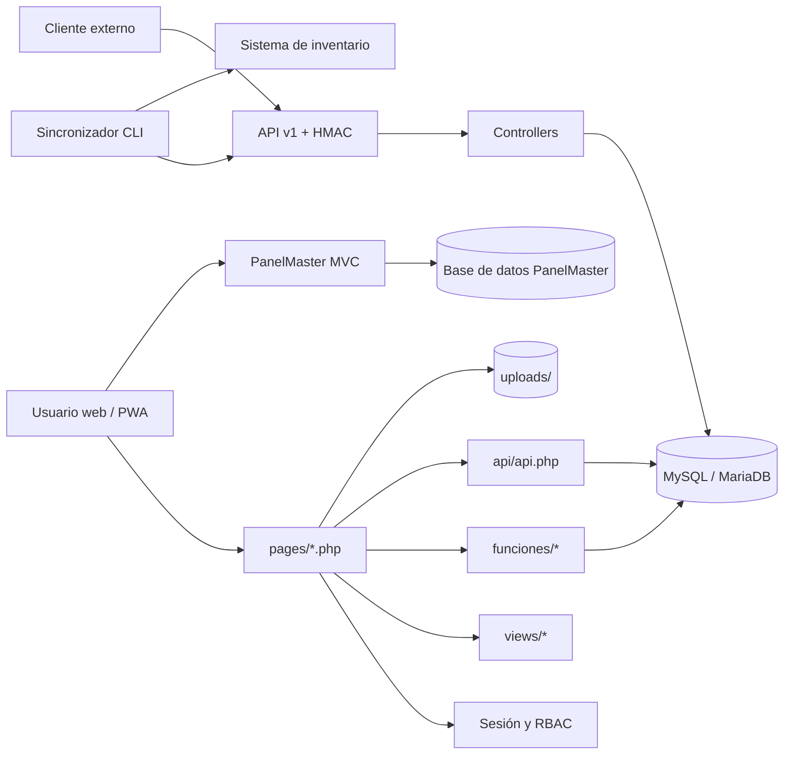

# ElectroPlan

Sistema web de Brightronix para centralizar la gestión de proyectos eléctricos, archivos técnicos, equipos, cronogramas, tareas y reportes de campo.

ElectroPlan combina una aplicación PHP tradicional con una API interna, una API de integración autenticada mediante HMAC, funciones PWA y módulos especializados como Smart PM y PanelMaster.

> **Estado del proyecto:** aplicación interna en desarrollo activo. Antes de desplegarla en producción, revise la sección [Seguridad y consideraciones de despliegue](#seguridad-y-consideraciones-de-despliegue).

## Contenido

- [Funciones principales](#funciones-principales)
- [Tecnologías](#tecnologías)
- [Arquitectura](#arquitectura)
- [Estructura del repositorio](#estructura-del-repositorio)
- [Requisitos](#requisitos)
- [Instalación local](#instalación-local)
- [Cómo funciona](#cómo-funciona)
- [Roles y permisos](#roles-y-permisos)
- [API de integración v1](#api-de-integración-v1)
- [Integración con inventario](#integración-con-inventario)
- [PanelMaster](#panelmaster)
- [PWA y aplicaciones móviles](#pwa-y-aplicaciones-móviles)
- [Pruebas, CI y despliegue](#pruebas-ci-y-despliegue)
- [Seguridad y consideraciones de despliegue](#seguridad-y-consideraciones-de-despliegue)

## Funciones principales

- Inicio de sesión y autorización por rol.
- Dashboard general con acceso a proyectos, archivos y tareas.
- Creación, edición, asignación, filtrado y baja lógica de proyectos.
- Estados de proyecto: `Planning`, `Active`, `On Hold` y `Completed`.
- Directorio de usuarios asignados a proyectos.
- Carpetas jerárquicas, permisos por carpeta y reglas de visibilidad.
- Carga individual, masiva, por carpeta y mediante archivos ZIP.
- Búsqueda de archivos por nombre, proyecto y estructura de carpetas.
- Versionado, vista previa, descarga, renombrado, movimiento y papelera.
- Editor de PDF e imágenes con anotaciones, medición, calibración y exportación.
- Generación de reportes de campo con archivos adjuntos.
- Smart PM: etapas, tareas, subtareas, plantillas, tiempos, pausas, vencimientos y métricas.
- Tareas personales y transferencia de tareas a proyectos.
- Timeline y seguimiento de actividad.
- API HMAC para consultar, crear, actualizar y exportar proyectos.
- Sincronización CLI de proyectos con un sistema de inventario.
- PWA instalable con página de respaldo sin conexión.
- PanelMaster para diseño de paneles, cálculo de cargas y exportación a Excel.

## Tecnologías

### Backend

- PHP 8.2 recomendado; el módulo PanelMaster admite PHP 8.0 o superior.
- PDO con MySQL/MariaDB.
- Sesiones PHP para la aplicación web.
- Firmas HMAC-SHA256 para la API v1.
- Apache y `.htaccess` para límites de carga, caché y rutas del módulo PanelMaster.
- Composer únicamente para dependencias de PanelMaster.

### Frontend

- HTML, CSS y JavaScript sin framework de SPA.
- Bootstrap 5.3.
- Font Awesome.
- Chart.js.
- PDF.js, Fabric.js y Konva para previsualización y anotaciones.
- SheetJS, jsPDF y jsPDF-AutoTable para lectura y exportación.
- Dropzone.js en la interfaz independiente de carga masiva.

### Persistencia

- MySQL 8 o MariaDB 10.4+.
- Archivos físicos en `uploads/` y metadatos en MySQL.
- JSON para anotaciones, adjuntos y datos de planificación especializados.

## Arquitectura

La aplicación principal utiliza una arquitectura PHP modular orientada a páginas. Las páginas componen vistas compartidas, llaman servicios y funciones del dominio y acceden a MySQL mediante una conexión PDO común.



### Capas principales

1. **Presentación:** `pages/`, `views/` y `assets/` contienen las páginas, plantillas, estilos y scripts.
2. **Autenticación y autorización:** `core/auth/session.php` valida la sesión; `api/rbac.php` aplica permisos globales y por proyecto.
3. **Lógica de aplicación:** `funciones/`, `api/api.php` y `task_manager/` implementan proyectos, archivos, reportes y Smart PM.
4. **Datos:** `core/db/connection.php` crea la conexión PDO; los scripts SQL definen el esquema y sus migraciones.
5. **Integraciones:** `api/v1/` expone recursos firmados con HMAC e `integrations/` contiene clientes externos.
6. **Módulos independientes:** `panel_schedule/public_html/` contiene PanelMaster con su propio patrón MVC, configuración y esquema.

## Estructura del repositorio

```text
electroplan/
├── admin/                       # Administración de usuarios y configuración
├── api/
│   ├── api.php                  # API interna basada en acciones y sesión
│   ├── rbac.php                 # Autorización y visibilidad por proyecto
│   └── v1/                      # API REST-like autenticada con HMAC
├── apps/                        # Proyectos nativos Android/iOS basados en Capacitor
├── assets/                      # CSS, JavaScript, iconos e imágenes
├── core/
│   ├── auth/session.php         # Inicio y validación de sesión
│   ├── db/connection.php        # Conexión PDO
│   └── file_paths.php           # Normalización y resolución de rutas
├── db/migrations/               # Migraciones incrementales de la aplicación principal
├── docs/                        # Notas y migraciones auxiliares
├── funciones/                   # Funciones compartidas del dominio
├── integrations/inventory/      # Sincronización de proyectos con inventario
├── pages/                       # Entradas web de la aplicación principal
├── panel_schedule/public_html/  # PanelMaster: módulo MVC independiente
├── sql/                         # SQL para funciones opcionales/especializadas
├── task_manager/                # Dominio y endpoints de Smart PM
├── uploads/                     # Archivos cargados por los usuarios
├── views/                       # Header, footer, sidebar y modales compartidos
├── wireway-electrical room/     # Herramientas de diseño de cuartos eléctricos
├── brightro_electroplan_v2.sql  # Esquema base de ElectroPlan
├── manifest.webmanifest         # Manifiesto PWA
├── offline.html                 # Página de respaldo sin conexión
└── sw.js                        # Service worker
```

El `index.php` de la raíz es una utilidad independiente de carga masiva con Dropzone. La entrada habitual de la aplicación es `pages/login.php`.

## Requisitos

- Apache 2.4 con PHP 8.2 recomendado.
- MySQL 8 o MariaDB 10.4+.
- Extensiones PHP: `pdo`, `pdo_mysql`, `json`, `fileinfo`, `mbstring`, `curl`, `zip` y `openssl`.
- Acceso de escritura del usuario del servidor web a `uploads/` y `logs/`.
- Composer 2 para instalar o actualizar las dependencias de PanelMaster.
- Conexión a Internet para las bibliotecas cargadas desde CDN, salvo que se alojen localmente.

La configuración actual asume un entorno similar a XAMPP/Laragon y una aplicación disponible bajo `/electroplan`.

## Instalación local

### 1. Clonar el repositorio

```bash
git clone https://github.com/Juanospafx/electroplan.git
```

Coloque el proyecto en el directorio público de Apache. En XAMPP para Windows, por ejemplo:

```text
C:\xampp\htdocs\electroplan
```

### 2. Crear la base de datos principal

El volcado base crea y utiliza la base `brightro_electroplan_v2`:

```bash
mysql -u root -p < brightro_electroplan_v2.sql
```

Después del volcado base, aplique las funciones que no están incluidas en esa instantánea:

```bash
mysql -u root -p brightro_electroplan_v2 < db/migrations/2026-05-21_rbac_visibility.sql
mysql -u root -p brightro_electroplan_v2 < db/migrations/2026-06-03_file_search_indexes.sql
mysql -u root -p brightro_electroplan_v2 < sql/image_annotations.sql
```

Las migraciones `2026_04_29_folders_depth_permissions.sql` y `2026-05-01_create_file_views.sql`, así como la estructura de adjuntos de reportes, ya aparecen en el volcado base actual. No las ejecute de nuevo sobre una instalación nueva sin verificar antes el esquema.

### 3. Configurar la conexión

Edite `core/db/connection.php` y adapte los valores a su entorno:

```php
$host = 'localhost';
$db   = 'brightro_electroplan_v2';
$user = 'root';
$pass = '';
```

Para producción, mueva estas credenciales a variables de entorno o a un archivo de configuración fuera del directorio público.

### 4. Crear el primer administrador

El volcado no inserta usuarios. Genere un hash seguro:

```bash
php -r "echo password_hash('CAMBIE_ESTA_CONTRASENA', PASSWORD_DEFAULT), PHP_EOL;"
```

Inserte el hash resultante:

```sql
INSERT INTO users (username, password, role)
VALUES ('admin', 'HASH_GENERADO', 'admin');
```

### 5. Preparar directorios de escritura

El servidor web debe poder crear o modificar contenido en:

```text
uploads/
logs/
```

No otorgue permisos globales `777` en producción. Asigne el propietario/grupo del proceso de Apache y use el mínimo permiso necesario.

### 6. Abrir la aplicación

```text
http://localhost/electroplan/pages/login.php
```

Inicie sesión con el usuario administrador creado en el paso anterior.

## Cómo funciona

### Flujo de una solicitud web

1. Una página de `pages/` incluye `core/auth/session.php`.
2. La sesión exige `user_id`, `username` y `role`; si falta alguno, redirige al login.
3. La página carga `core/db/connection.php` y consulta MySQL mediante PDO.
4. Las vistas compartidas de `views/` construyen la interfaz y el menú según el rol.
5. Las operaciones asíncronas llaman `api/api.php` o `task_manager/api.php`.
6. Los archivos se guardan en disco y sus metadatos, permisos, versiones y reportes se conservan en la base de datos.

### Proyectos y documentos

Un proyecto agrupa información del cliente, fechas, estado, usuarios, carpetas, archivos, etapas y tareas. Los archivos admiten baja lógica mediante `deleted_at`, versionado mediante `version_group_id` y `version_number`, y reglas de acceso por carpeta o archivo.

La creación de proyectos puede generar carpetas funcionales como `Drawings`, `Photos`, `RFI`, `Panel Schedule`, `Panel Tags`, `Permit`, `Expenses` y otras áreas operativas.

### Editor y reportes

`pages/editor.php` carga PDF o imágenes, permite calibrar escalas, medir y dibujar anotaciones. Las anotaciones se serializan como JSON y pueden exportarse junto con una imagen editada o un reporte PDF. Los reportes de campo se vinculan al archivo original y pueden tener adjuntos.

### Smart PM

El módulo `task_manager/` administra:

- plantillas de etapas y tareas;
- asignación de tareas a usuarios;
- inicio, pausa, reanudación, extensión, bypass y finalización;
- tiempo estimado, tiempo trabajado y vencimientos;
- subtareas/RFI, adjuntos y bitácora;
- tareas rápidas o personales;
- estado de salud y rendimiento de proyectos;
- importación y exportación CSV.

## Roles y permisos

### Roles globales

| Rol | Alcance general |
| --- | --- |
| `admin` | Administración completa, usuarios, directorio, timeline, configuración y papelera. |
| `technician` | Trabajo operativo sobre proyectos, archivos y tareas permitidas. |
| `viewer` | Acceso principalmente de lectura, sujeto a visibilidad. |

### Roles por proyecto

El RBAC por proyecto normaliza y utiliza roles más específicos:

- `owner`
- `admin`
- `project_manager`
- `field_manager`
- `foreman`
- `internal_worker`
- `external_worker`

Por compatibilidad, `technician` se trata como `internal_worker` y `viewer` como `external_worker` en el contexto de proyecto. Las reglas de `folder_visibility_rules`, `file_visibility_rules` y `role_permissions` pueden ampliar o restringir la visibilidad.

## API de integración v1

La API se encuentra en `api/v1/` y devuelve JSON con una de estas formas:

```json
{ "ok": true, "data": {} }
```

```json
{ "ok": false, "error": { "code": "...", "message": "..." } }
```

### Autenticación

Todas las rutas excepto `GET /api/v1/health` requieren:

- `X-Client-Id`
- `X-Timestamp`: timestamp Unix, con tolerancia predeterminada de 300 segundos.
- `X-Signature`: HMAC SHA-256 hexadecimal.

El contenido firmado es:

```text
METHOD + "\n" + PATH + "\n" + TIMESTAMP + "\n" + RAW_BODY
```

Los clientes y roles se configuran actualmente en `api/v1/config.php`. Sustituya el secreto de ejemplo y no almacene secretos reales en Git.

### Endpoints

| Método | Ruta | Descripción |
| --- | --- | --- |
| `GET` | `/api/v1/health` | Estado básico de la API. |
| `GET` | `/api/v1/projects` | Lista de proyectos. |
| `GET` | `/api/v1/projects/{id}` | Detalle de un proyecto. |
| `GET` | `/api/v1/projects/{id}/export` | Exportación estructurada para integraciones. |
| `POST` | `/api/v1/projects` | Crear proyecto. |
| `PATCH` | `/api/v1/projects/{id}` | Actualizar proyecto. |
| `POST` | `/api/v1/projects/{id}/assign` | Asignar usuarios; requiere cliente administrador. |
| `GET` | `/api/v1/projects/{id}/folders` | Carpetas de un proyecto. |
| `POST` | `/api/v1/files` | Registrar/cargar un archivo. |
| `GET` | `/api/v1/directory` | Consultar el directorio. |

El servidor debe redirigir las rutas `/api/v1/*` al front controller `api/v1/index.php`. El repositorio raíz no incluye actualmente esa regla de reescritura.

> **Nota técnica:** en el estado actual del repositorio, revise la ruta usada para incluir la conexión desde `api/v1/index.php`; desde ese directorio la conexión principal se encuentra en `../../core/db/connection.php`.

## Integración con inventario

`integrations/inventory/sync_project.php` exporta un proyecto por la API HMAC y envía el resultado a un endpoint de inventario.

Variables requeridas:

```text
ELECTROPLAN_API_BASE
ELECTROPLAN_CLIENT_ID
ELECTROPLAN_CLIENT_SECRET
INVENTORY_UPSERT_URL
```

Variable opcional:

```text
INVENTORY_SHARED_KEY
```

Ejecución:

```bash
php integrations/inventory/sync_project.php 123
```

La extensión PHP `curl` debe estar habilitada.

## PanelMaster

`panel_schedule/public_html/` es una aplicación MVC independiente para proyectos de paneles eléctricos, panelboards, cálculo de cargas y exportación a Excel.

### Instalación

```bash
cd panel_schedule/public_html
composer install
```

1. Configure la base en `app/config/database.php`.
2. Ejecute `app/migrations/001_create_tables.sql`.
3. Opcionalmente ejecute `app/migrations/002_seed.sql`.
4. En actualizaciones, aplique las migraciones posteriores que todavía no estén presentes.
5. Configure el `DocumentRoot` en `panel_schedule/public_html/public` o publique esa carpeta mediante Apache.

Rutas principales:

- `/projects`
- `/projects/new`
- `/projects/{id}`
- `/projects/{id}/panels/new`
- `/panels/{id}/edit`
- `/projects/{id}/export.xlsx`
- `/panels/{id}/export.xlsx`

PanelMaster incluye protección CSRF para solicitudes POST y usa `phpoffice/phpspreadsheet` para exportar archivos Excel.

## PWA y aplicaciones móviles

`manifest.webmanifest`, `sw.js` y `offline.html` permiten instalar ElectroPlan como aplicación web. El service worker almacena el shell visual, evita cachear `/api/` y `/uploads/`, y muestra la página offline cuando falla una navegación.

Los directorios `apps/android-capacitor/` y `apps/ios-capacitor/` contienen proyectos nativos de Capacitor. En la instantánea actual se incluyen principalmente los proyectos de plataforma y dependencias, no un flujo de compilación raíz documentado; deben tratarse como artefactos auxiliares hasta normalizar su configuración y scripts.

## Pruebas, CI y despliegue

No existe todavía una suite automatizada de pruebas unitarias o de integración. La verificación mínima local para PHP es:

```bash
find . -name "*.php" -not -path "*/vendor/*" -not -path "*/node_modules/*" -print0 \
  | xargs -0 -n1 php -l
```

GitHub Actions ejecuta lint de PHP 8.2 en pushes y pull requests. Los pushes a `main` activan además un despliegue FTP mediante secretos del repositorio:

- `FTP_SERVER`
- `FTP_USERNAME`
- `FTP_PASSWORD`

El flujo FTP no utiliza limpieza destructiva del servidor (`dangerous-clean-slate: false`).

## Seguridad y consideraciones de despliegue

Antes de publicar ElectroPlan:

1. Mueva las credenciales de base de datos fuera del código y use variables de entorno.
2. Cambie el secreto de ejemplo de `api/v1/config.php` y gestione secretos fuera de Git.
3. Añada la reescritura necesaria para la API v1 y verifique su ruta de conexión PDO.
4. Obligue HTTPS y configure cookies de sesión con `Secure`, `HttpOnly` y `SameSite`.
5. Deshabilite o retire páginas de diagnóstico y recuperación como `pages/check_db.php`, `pages/debug_task_manager.php`, `admin/fix_password.php` y `admin/reset_admin.php`.
6. Impida la ejecución de scripts dentro de `uploads/` y limite tipos, tamaño y nombres de archivo en el servidor.
7. Proteja `uploads/`, reportes y archivos mediante control de acceso; no confíe únicamente en URLs difíciles de adivinar.
8. Restrinja CORS, cabeceras y permisos del sistema de archivos según el entorno.
9. Revise el límite de carga actual de `.htaccess`: admite archivos de hasta aproximadamente 10 GB y procesos de hasta una hora.
10. Aloje localmente las dependencias CDN si la aplicación debe operar en una red aislada.
11. Añada respaldos periódicos de MySQL y `uploads/` y pruebe su restauración.
12. Añada pruebas automatizadas para autenticación, RBAC, cargas, API HMAC y operaciones destructivas.

## Mantenimiento de la base de datos

- Conserve el volcado base como instantánea y las migraciones como historial incremental.
- No ejecute una migración solo por su fecha: compruebe primero si el cambio ya está incluido en el volcado.
- Registre nuevas migraciones con una marca temporal y una descripción clara.
- Pruebe las migraciones en una copia de la base antes de producción.
- Haga respaldo de la base y de `uploads/` como una unidad para mantener consistencia.

## Licencia

Este repositorio no incluye actualmente un archivo de licencia. Añada uno antes de distribuir el software fuera de la organización.
